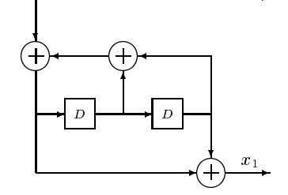

#
 TurboCodes

####
Implementation of a TurboCode coder and decoder in C++ 

##
## Why TurboCodes?

### 1. Introduction
A well known result from Information Theory is that a randomly chosen code of sufficiently large block length **n**, is capable of approaching channel capacity. The maximum likelihood decoding of such a code increases exponentially with **n** up to a point where decoding becomes physically unrealizable.

So here it's where ***Turbo Codes*** appear. The goal was to develop codes that have large equivalent block lengths, yet contain enough structure that practical decoding is possible.

###
### 2. Initial problems
In the original paper, the authors show through simulation that turbo codes are capable of achieving an arbitrarily small Bit Error Rate (BER) of 105 at an Eb/No ratio of just 0.7 decibels. However, in order to achieve this level of performance, large block sizes of 65,532 data bits are required.

Because of the prohibitively long latency involved with such large block sizes, the original turbo code is not well suited for real time voice communication systems, such as the recent IS-95 CDMA cellular standard. Current work on the subject of turbo codes has focused on the design and analysis of short block length codes that are compatible with the IS-95 standard.

###
### 3. Random-like code with enough structure?
Due to the use of a pseudo-random interleaver, turbo codes appear random to the channel, yet posses enough structure that decoding can be physically realized.

Because turbo codes are linear block codes, the encoding operation can be viewed as the modulo-2 matrix multiplication of an information vector with a generator matrix. For turbo codes of relatively short block length, it is possible to use the generator matrix and its associated parity check matrix to obtain an upper bound on the probability of code word error. Although the probability of code word error provides some insight into the performance of the code, it is slightly irrelevant when one considers the fact that the turbo decoder attempts to minimize the probability of bit error rather than the probability of code word error.

##
## Parallel Concatenated Coding
A ***Turbo Code*** consist of two or more concatenated codes, that have passed through an interleaver(**π**) and an encoder(**ENC**).

###

In this figure we can see a data block **u**, which is **k** bits long, and we have an output of **n** bits long. The **PAD** appends ***n - k*** bits to the data block, so we now have blocks of **n** bits long. Then we send the data, in parallel, through **M** sets of interleavers(**π**) and then through the encoders(**ENC**). Each **π** scrambles the **X0** sequence on a pseudo-random fashion and feeds the output to the constituent encoder. Then each encoder sends a parity sequence **Xi** as its output.

Then the **M** sequences are concatenated with the 
**X0** sequence to form the code word. The overall code rate of this encoder is:

##
## The Constituent Encoder
In most applications, a **Turbo Code** of **R=1/3** is used, and the encoders use to be **Systematic Recursive Convolutional Encoders**. By using a convolutional encoder, it is possible for the decoder to utilize a modified version of the **Viterbi Algorithm**.

These type of encoders are the ones we will use in the project and also the ones which will be explained in this guide.

###
We can see that it only consists of 2 **ENC** and 1 **π**, so the first encoder takes directly the padded code, without interleaving it.

This will lead us to 3 outputs, which will be concatenated and send as the encoded message.

###
### The encoder
Let's see how the inside of the encoder works. Assume we have an encoder with **K=3**. The scheme will be as follows:

We can see that the first

